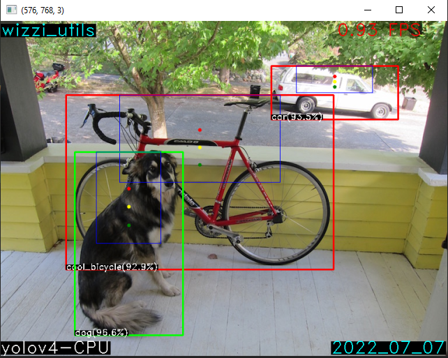
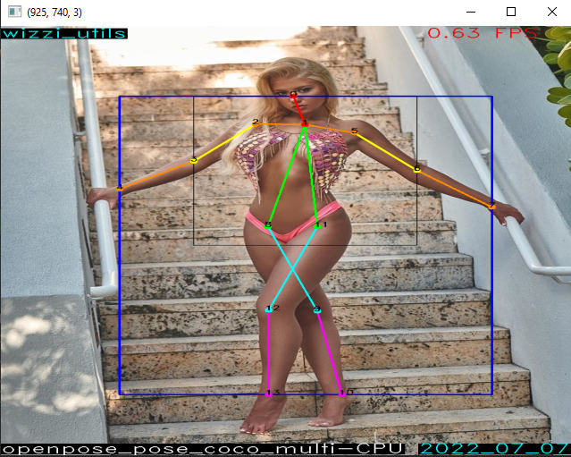
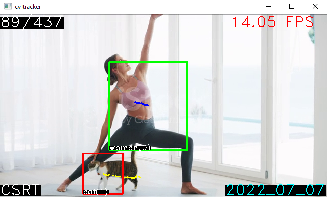

# Package [wizzi utils](https://github.com/2easy4wizzi/wizzi_utils_pypi/tree/main):


## Brief

* "wizzi_utils" main usage is for debugging and fast coding.
* The package is cross-platform (most of the functions tested on Windows and linux).
* The package is well documented and contain many easy access common functions.
    * In addition, almost every function is used in a test(more an example) I've written for learning purposes.
* Package includes tools for json, open_cv, pyplot, socket, torch, text to speach and more.
* If by any chance, I used code and didn't give credit, please contact me, and I'll remove the code or specify the
  source.
* Contact: giladeini@gmail.com

## Usage

```python
import wizzi_utils as wu  # pip install wizzi_utils

# The above import, will give access to all wizzi utils main module and the extra modules 
# only if the packages are installed
print(wu.to_str(var=2, title='my_int'))  # this will 100% work
wu.test.to_str_test()  # for a wide example of to_str function
print(wu.tt.to_str(var=3, title='my_int'))  # tt for torch tools. will work if torch installed
wu.tt.test.to_str_test()  # for a wide example of tt.to_str function
# If facing packages issues and want to know what packages I used, call the following
wu.download_wizzi_utils_env_snapshot()  # updated on 10/10/2022 
```

### list of all the packages

```python
import wizzi_utils as wu

wu.test.test_all()  # main module - all function that dont require extra installations but wizzi_utils
wu.jt.test.test_all()  # json tools 
wu.cvt.test.test_all()  # cv2 tools 
wu.pyplt.test.test_all()  # pyplot tools 
wu.st.test.test_all()  # socket tools
wu.tt.test.test_all()  # torch tools 
wu.tflt.test.test_all()  # tensorflow lite tools
wu.tts.test.test_all()  # text to speach tools
wu.models.test.test_all()  # models - cv2 and tf lite models. tracking, object detection and pose estimation
wu.got.test.test_all()  # google drive tools - work in progress
```

### Some examples

```python
import wizzi_utils as wu

"""
* wu.main_wrapper()
* Extremely useful if run experiments and want to have the meta data saved
* e.g. the interpreter, the time, the pc details ...
"""


def main():
    msg = "Hello world in red "
    msg += wu.get_emoji(wu.EMOJIS.SMILING_FACE_WITH_3_HEARTS)
    msg = wu.add_color(string=msg, ops=['Red', 'bold', 'underlined'])
    print(msg)
    # wu.test.add_color_test()
    # wu.test.get_emoji_test()
    return


if __name__ == '__main__':
    wu.main_wrapper(
        main_function=main,
        seed=42,
        ipv4=True,
        cuda_off=False,
        torch_v=True,
        tf_v=True,
        cv2_v=True,
        with_pip_list=False,
        with_profiler=False
    )
```


```python
import wizzi_utils as wu

# fps measurements:
fps = wu.FPS(last_k=3, cache_size=5, summary_title='classFPS_test')
for t in range(10):
    ack = (t + 1) % 2 == 0  # display only on even rounds
    fps.start(ack_progress=False)
    # do_work of round t
    wu.sleep(seconds=0.03)
    if t == 0:  # e.g. slow first iteration
        wu.sleep(seconds=1)
    fps.update(ack_progress=ack)
    if t == 5:
        print('\tget_fps() = {:.4f}'.format(fps.get_fps()))
fps.finalize()
```


```python
import wizzi_utils as wu

"""
* cv2 show image with extra control:
* concatenation of several images(e.g. 2 cameras frames)
* display in a grid (2x1 1x2 3x3)
* resize (0.3 -> 30%, (200, 400)->total image to (200, 400), fs for full screen
* window location
* and more...
"""
img_utl = 'https://cdn.sstatic.net/Sites/stackoverflow/img/logo.png'
wu.st.download_file(url=img_utl, dst_path='./so_logo.png')  # st for socket tools
bgr = wu.cvt.load_img(path='./so_logo.png', ack=True)
gray = wu.cvt.bgr_to_gray(bgr)
rgb = wu.cvt.bgr_to_rgb(bgr)
wu.cvt.add_header(bgr, header='bgr', loc='bl', text_color='lime')
wu.cvt.add_header(gray, header='gray', loc='bl')
wu.cvt.add_header(rgb, header='rgb', loc='bl', text_color='aqua')
wu.cvt.display_open_cv_images(
    imgs=[bgr, gray, rgb],
    ms=0,
    title='display images',
    loc='bc',  # bottom center
    resize=1.5,  # 150%
    grid=(3, 1),  # 3 rows 1 col
    header='cool, no?',
    separator_c='aqua',
)
```


```python
import wizzi_utils as wu

"""
* object detection models
* pose detection models
* tracking
"""
wu.models.test.test_cv2_object_detection_models()
wu.models.test.test_cv2_pose_detection_models()
wu.models.test.test_cv2_tracking_models()
```

<!---  -->
<!---  -->
<!---  -->


```python
import wizzi_utils as wu

# text to speak gui over pyttsx3 and pyQt5 packages
wu.tts.test.run_machine_buddy_gui_test()
```


